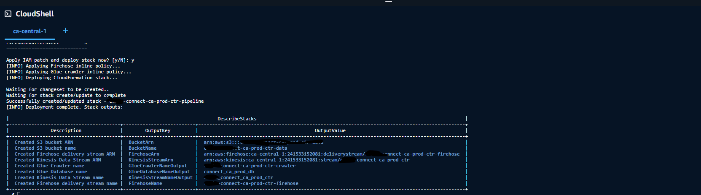

# Amazon Connect Data Pipeline Deployment Toolkit

## Purpose

This toolkit is designed to automate the deployment of an Amazon Connect data pipeline in a consistent, repeatable, and production-friendly way.

In real-world projects, setting up a data pipeline for Amazon Connect (especially for CTR data) typically involves:

- Creating multiple AWS resources (Kinesis, Firehose, S3, Glue)
- Configuring IAM roles and permissions
- Handling optional data transformation logic
- Ensuring everything works together correctly

Manual setup through the AWS UI is:

- Time-consuming
- Error-prone (especially IAM permissions)
- Hard to reproduce across environments

This toolkit solves these problems by providing a fully automated workflow using:

| Technology | Role |
|---|---|
| **CloudFormation (CFN)** | Infrastructure provisioning |
| **AWS CLI** | Deployment orchestration |
| **JMESPath** | Dynamic value extraction (e.g., ARNs, account info) |
| **Lambda** | Optional data transformation (e.g., attribute normalization) |

---

## Included Components

This toolkit consists of three main parts.

### 1. CloudFormation Template (`data_pipeline.yaml`)

Defines the full data pipeline infrastructure:

- **S3 Bucket** — Data landing zone
- **Kinesis Data Stream** — Data ingestion
- **Kinesis Firehose** — Delivery to S3
- **Glue Database** — Metadata layer
- **Glue Crawler** — Schema discovery

**Key features:**

- Supports optional Firehose Lambda transformation
- Designed specifically for Amazon Connect CTR data pipelines

---

### 2. Deployment Script (`deploy_pipeline.sh`)

A helper script that automates:

- Parameter input (CLI or interactive)
- IAM role ARN lookup
- Lambda ARN lookup (if transformation enabled)
- Inline IAM policy generation and attachment
- CloudFormation deployment

**Key value:**

- Eliminates common deployment failures caused by missing IAM permissions
- Provides a one-command deployment experience
- Adds a confirmation step before execution

---

### 3. Lambda Function (Optional)

Used for data transformation in Firehose. Typical use case (CTR data):

- Normalize attribute keys (e.g., lowercase, remove spaces/hyphens)
- Clean inconsistent user-defined attributes
- Standardize schema before data lands in S3

> **Note:** This Lambda is optional — only required if `EnableTransformation=true`.

---

## Deployment Workflow

### Step 1 — Deploy Lambda (Optional)

If you plan to enable transformation, create the Lambda function in advance:

- Create via AWS Console or CLI (no additional automation needed)
- Ensure Lambda is in the **same region** as the stack
- Ensure Lambda can be invoked by Firehose

---

### Step 2 — Prepare CloudFormation Template

Ensure your `data_pipeline.yaml` file is available locally.

---

### Step 3 — Run Deployment Script

```bash
./deploy.sh
```

You can either provide parameters via CLI or enter them interactively.

**Example CLI input:**

```bash
./deploy.sh \
  --region us-east-1 \
  --stack my-connect-pipeline \
  --pipeline ctr \
  --bucket my-ctr-data-bucket \
  --stream ctr-stream \
  --firehose-stream ctr-firehose \
  --database ctr_db \
  --crawler ctr_crawler \
  --firehose-role my-firehose-role \
  --crawler-role my-glue-role \
  --enable-transformation true \
  --lambda my-transform-lambda \
  --buffer-interval 300 \
  --buffer-size 5
```

---

### Step 4 — Confirm Deployment

Before execution, the script will display a preview:

```
========== PREVIEW ==========
...
Apply IAM patch and deploy stack now? [y/N]:
```

Enter `y` to confirm. The script will then:

1. Patch IAM roles (inline policies)
2. Deploy the CloudFormation stack
3. Output stack results

---

### Step 5 — Verify Deployment

After deployment, verify via the following:

- [ ] Check S3 bucket for incoming data
- [ ] Verify Firehose is active
- [ ] Run Glue Crawler
- [ ] Query data via Athena
## Example Output



## Notes
IAM roles must already exist before running the script
This toolkit assumes consistent naming across resources
Inline policies are used for simplicity and automation
For enterprise setups, consider switching to managed IAM policies
## Summary

This toolkit provides a fully automated, end-to-end solution for deploying an Amazon Connect data pipeline.

It transforms a traditionally manual and error-prone process into:

a reproducible, script-driven deployment workflow

Key benefits:

Faster setup
Fewer IAM-related failures
Easy reuse across